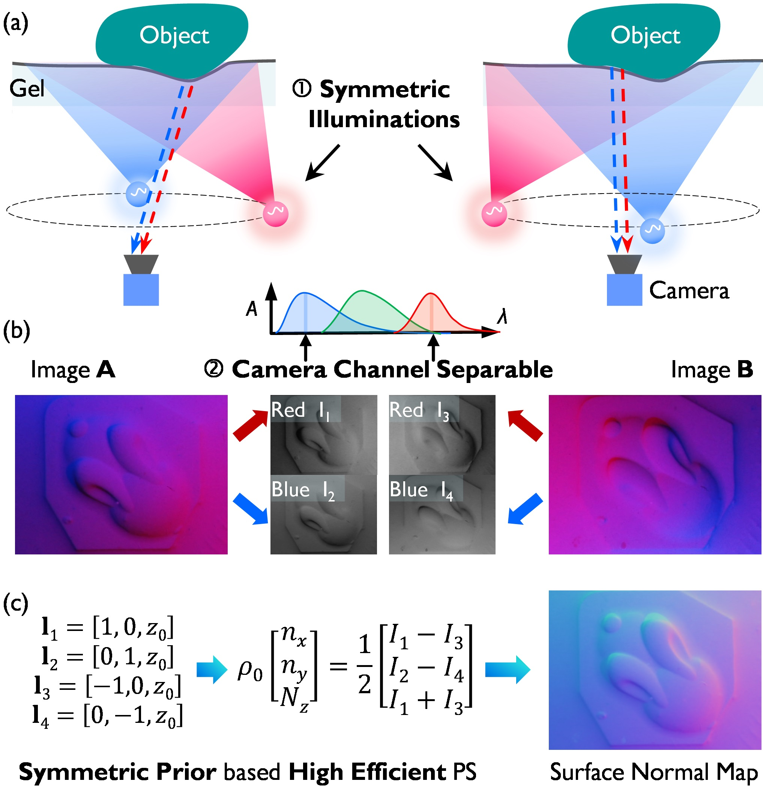
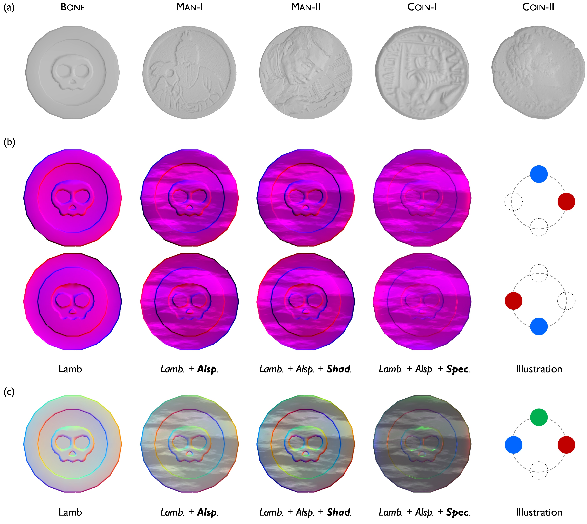
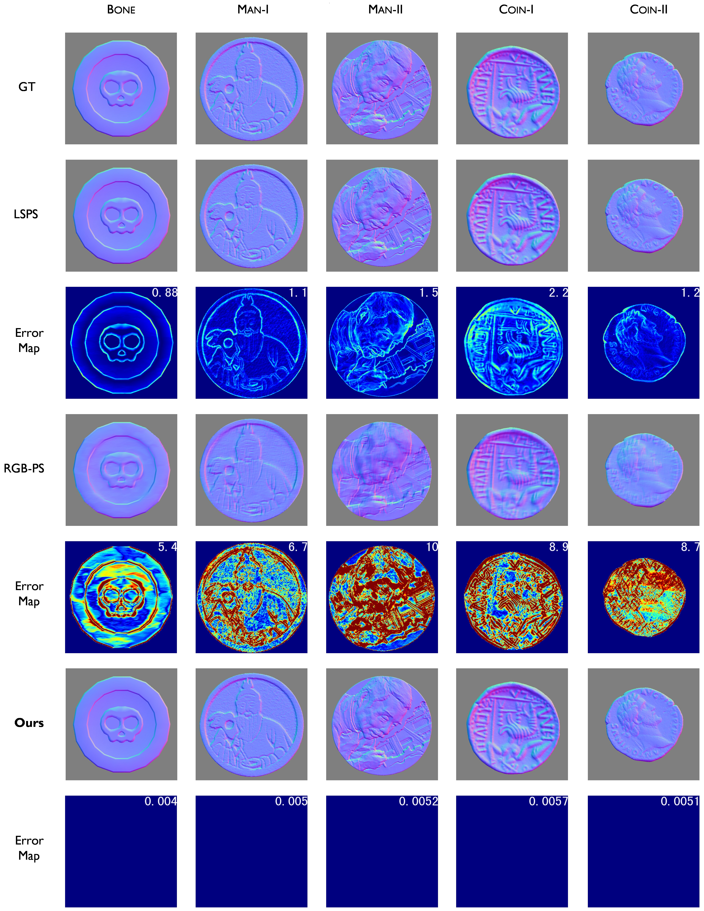
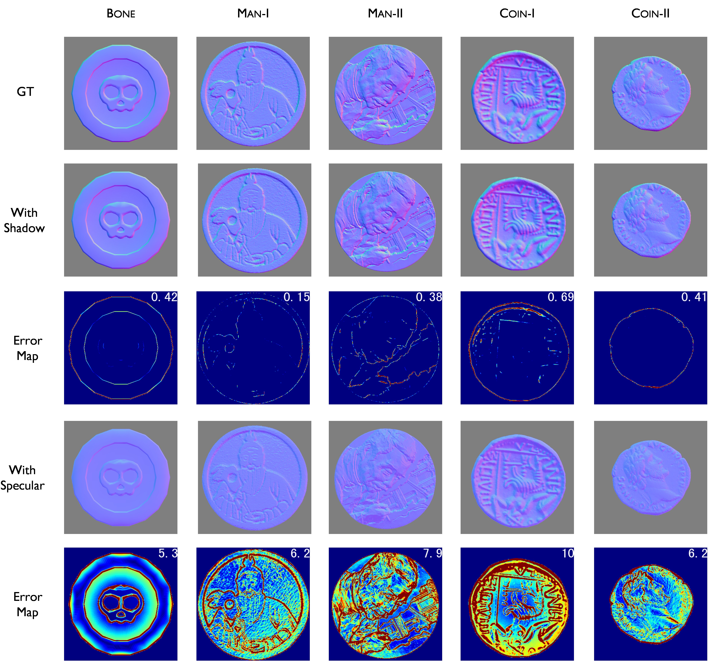
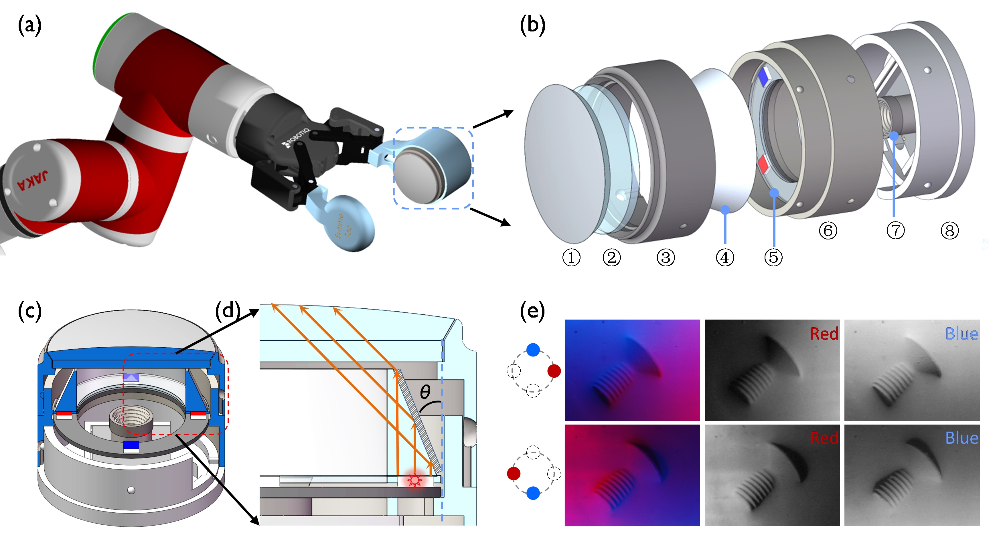
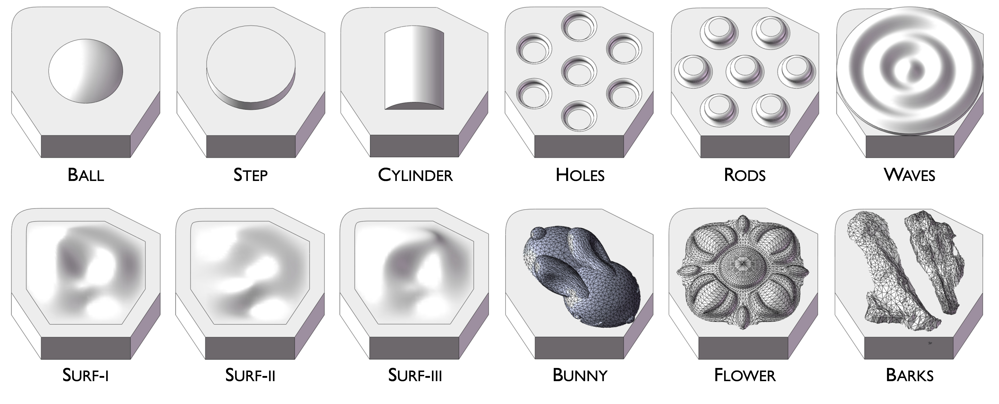
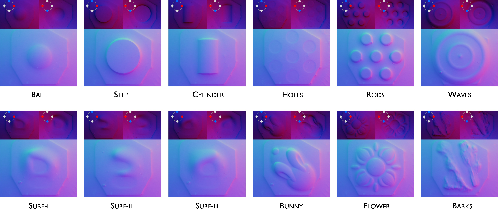

# SymmeTac
> This repo contains the details of SymmeTac, which is a high-efficiency photometric stereo method for camera-based tactile sensor.

[Symmetric Color LED Driven Effcient Photometric Stereo Reconstruction Methods for Camera-based Tactile Sensors](arxiv.org/abs/xxxx.xxxx)

## 1. Brife Review
To improve the geometry (surface normal map) reconstruction efficiency of camera-based tactile sensor, we propose SymmeTac. SymmeTac fully leverages the symmetric prior of light source and the spectral charictristics of CMOS to achieve highly efficient surface normal reconstruction. Specifically, the symmetric prior of light soruce can simplify the imaging process, and lead to a very simple equation for surface normal calculation; The red and blue channel of chromatic camera has little crosstalk, which helps us obtain two observations with one capture.   

## 2. Experiment Results
To evaluate the effectiveness of our method, we conduct simulation experiments on rendered images, and real-world experiments on robot.

### 2.1 Simulation 
To evaluate the performance on complex surface tactle details, we select 5 reliefs as test object. We use Blender and Cycles render engine to render images with diverse surface situation: Lambertian, spatial-variable and channel-wise albedo (Lamb + **Alsp.**), shadow (Lamb + **Alsp.** + **Shad.**), and speculare reflection (Lamb + **Alsp.** + **Spec.**).  

We chose typical photometric stereo algorithms: LSPS and RGB-PS, and compared their reconstruction results with our method. 

The robustness under shadows and specular reflections of our method was also evaluated. 

### 2.2 Real-world Experiments
We febricate a camera-based tactile sensor with propose light configuration and conduct e benchmark experiment, dynamic experiment, as well as the general tactile experiment. The equipment is prensent as follows: 

**Mini-Dataset.** We fabricate a mini dataset with diverse objects: 

and evaluate the reconstrcution results with proposed sensor and method: 

---
**Dynamic Exp.** To exhibit the high-efficency, we use the sensor to record the tactile information when manipulating the tools: 

 

 

 

---
**General Exp.** To exhibit the generality of the proposed method, we test the sensor on diverse objects: 

